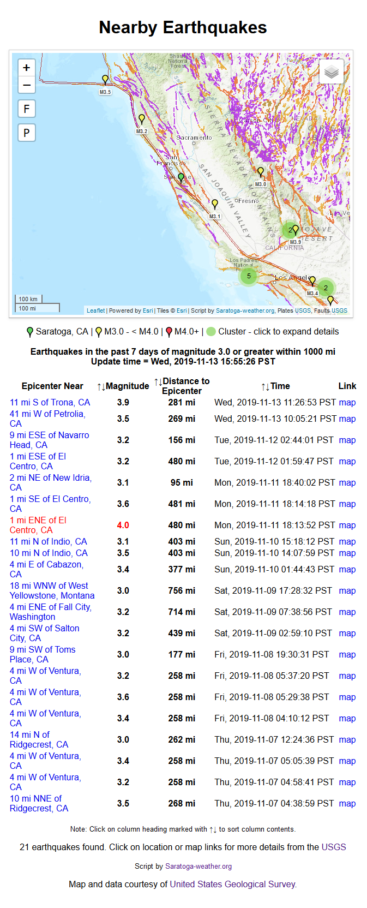

## Recent nearby earthquakes from USGS

Here in California, we're a bit sensitive to the earth moving (it happens a lot), so I wrote a PHP scripts to get, cache and reformat the last 7 days of earthquake information so it can be included on the website with links to additional info.  

The output of these scripts is XHTML 1.0-Strict compliant. All of them use the same style for inclusion into your webpage as shown in the example below.

**Note:** Version 2.00 of the script replaced Google maps with Leaflet/OpenStreetMaps scripts, so you no longer need a Google API key (or any API key to use the 5 included maps with the script.  

If you wish to use the OPTIONAL Mapbox.com tiles (terrain3, Satellite maps), you will need a Mapbox.com API key (called an "Access Token") which can be acquired (for free with 50K accesses usage/month) at:

https://www.mapbox.com/signup/?

in the _quakes.php_ script you can put

$setMapboxAPIkey = '-replace-this-with-your-API-key-here-';

Note: if using the Saratoga template set, put a new entry in _Settings.php_

$SITE['mapboxAPIkey'] = '-replace-this-with-your-API-key-here-';

A Mapbox API key is OPTIONAL .. you do not need it to use maps from 5 included free map tile providers.

The USA/World earthquake script uses the new USGS GeoJSON feed for data and provides information on USA quakes of 1.0+ magnitude and Worldwide quakes of 4.0+ magnitude. This script is included in the AJAX/PHP Base-USA and Base-World template sets. Sample output with USA settings:



This was invoked by using the following code:
```
<?php
# settings --------------------------
  $doIncludeQuake = true;
# uncomment ONE of the $setDistanceDisplay lines to use as template for distance displays  
#  $setDistanceDisplay = 'mi (km)';
  $setDistanceDisplay = 'mi';
#  $setDistanceDisplay = 'km (mi)';
#  $setDistanceDisplay = 'km';

  $setDistanceRadius  = 200;  // same units as first unit in $setDistanceDisplay
# NOTE: quakes of magnitude 1.0+ are available for USA locations only.
#    non-USA location earthquakes of magnitude 4.0+ are the only ones available from the USGS
  $setMinMagnitude = '2.0';  // minimum Richter Magnitude to display
  $setHighMagnitude = '4.0';  // highlight this Magnitude and greater

  $setMapZoomDefault = 7;    // default zoom for Google Map 1=world to 13=street

# script will use your $SITE[] values for latitude, longitude, timezone and time display format
  $setLatitude  = 37.2746251;    //North=positive, South=negative decimal degrees
  $setLongitude = -122.0229656;   //East=positive, West=negative decimal degrees
# The above settings are for saratoga-weather.org location
  $setLocationName = 'Saratoga, CA'; // city/town name for lat/long above
#
  $setTimeZone = "America/Los_Angeles";  //NOTE: this *MUST* be set correctly to
# translate UTC times to your LOCAL time for the displays.
# Use http://www.php.net/manual/en/timezones.php to find the timezone suitable for
#  your location.

#  pick a format for the time to display ..uncomment one (or make your own)
# $setTimeFormat = 'D, Y-m-d H:i:s T';  // Fri, 2006-03-31 14:03:22 TZone
  $setTimeFormat = 'D, d-M-Y H:i:s T';  // Fri, 31-Mar-2006 14:03:22 TZone

  $setDoLinkTarget = false;   // =true; to have links open in new page, =false; for XHTML 1.0-Strict

	$mapProvider = 'Esri_WorldTopoMap'; // ESRI topo map - no key needed
# $setMapProvider = 'OSM';     // OpenStreetMap - no key needed
# $setMapProvider = 'Terrain'; // Terrain map by stamen.com - no key needed
# $setMapProvider = 'OpenTopo'; // OpenTopoMap.com - no key needed
# $setMapProvider = 'Wikimedia'; // Wikimedia map - no key needed

# $mapProvider = 'MapboxSat';  // Map by Mapbox.com - API KEY needed in $setMapboxAPIkey
# $mapProvider = 'MapboxTer';  // Map by Mapbox.com - API KEY needed in $setMapboxAPIkey
 $setMapboxAPIkey = '--mapbox-API-key--';  // use this for the API key to MapBox

  include_once("quake-json.php");
?>
```

Also required is the styling and JavaScript &lt;script> statements in the &lt;head>...&lt;/head> part of the page (see the sample **quakes.php** page in this package for details).

This script loads the GeoJSON feed for all earthquakes in the last 7 days from the USGS. For the USA, magnitude 1.0+ quakes are available. For non-USA locations, the USGS only provides information on magnitude 4.0+ based on the data they receive from partner seismographic organizations. If you are installing the script for standalone use, do download the .ZIP package as it contains the graphics files needed for the Google Map. If you are using the AJAX/PHP template set (V3+), the script is already integrated into the Base-USA and Base-World templates.

For Base-World template users, the script is compatible with the language translation features of the template set. You may need to add to your **language-_LL_.txt** translation file the following entries (translated) in order to show the ouput in language _LL_.  
Note: the |of| entry below is used in the reports for quake location as in:  
  20 mi NNW **of** Saratoga, California

```
langlookup|Update time|Update time|
langlookup|of|of|
langlookup|No earthquakes of magnitude|No earthquakes of magnitude|
langlookup|or greater within|or greater within|
langlookup|reported in last 7 days|reported in last 7 days|
langlookup|Cluster - click to expand details|Cluster - click to expand details|
langlookup|Enable JavaScript to view the Google Map.|Enable JavaScript to view the Google Map.|
langlookup|Earthquakes in the past 7 days of magnitude|Earthquakes in the past 7 days of magnitude|
langlookup|or greater within|or greater within|
langlookup|Epicenter Near|Epicenter Near|
langlookup|Magnitude|Magnitude|
langlookup|Distance to Epicenter|Distance to Epicenter|
langlookup|Time|Time|
langlookup|Link|Link|
langlookup|map|map|
langlookup|Note: Click on column heading marked with|Note: Click on column heading marked with|
langlookup|to sort column contents.|to sort column contents.|
langlookup|earthquakes found. Click on location or map links for more details from the <a href="http://earthquake.usgs.gov/earthquakes/map/">USGS</a>|earthquakes found. Click on location or map links for more details from the <a href="http://earthquake.usgs.gov/earthquakes/map/">USGS</a>|
langlookup|Depth|Depth|
langlookup|Distance to epicenter|Distance to epicenter|
langlookup|Map and data courtesy of|Map and data courtesy of|
langlookup|United States Geological Survey|United States Geological Survey|
```

The **quake-json.php** script uses the USGS new GeoJSON feed for **1.0+** (USA) and **4.0+** (World) magnitude events and replaces the functionality of the above scripts.
